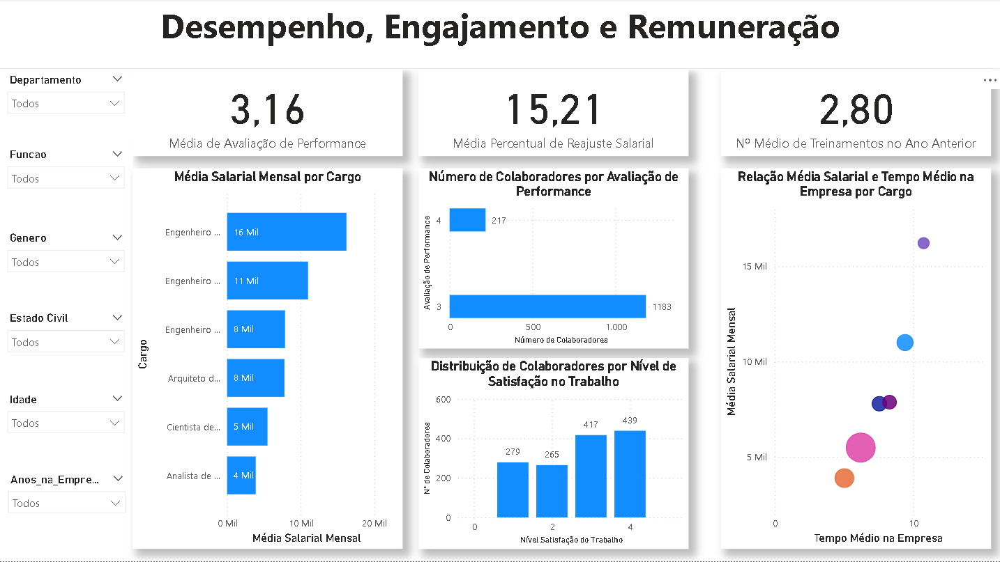

# Projeto de Portfólio: Dashboard Estratégico de RH - Talentos e Desempenho no Power BI

## Uma Jornada Analítica: Otimizando a Gestão de Pessoas com Dados

Olá! Eu sou **Heitor Pereira Fernandes Oliveira**, e este projeto de portfólio demonstra minha paixão por transformar dados em decisões estratégicas, especialmente no campo de Recursos Humanos. Este dashboard vai além dos números básicos, fornecendo insights profundos sobre a força de trabalho para impulsionar a gestão de talentos e o planejamento estratégico.

Minha jornada na análise de dados, reforçada pela minha formação em Engenharia de Computação e experiência anterior em análise de qualidade, me permite abordar os desafios de RH com uma mentalidade analítica e orientada a resultados.

### O Desafio de Negócio em RH

Em um ambiente empresarial cada vez mais competitivo, a gestão de pessoas baseada em intuição é coisa do passado. As equipes de RH precisam de dados para:

* Compreender a composição demográfica da força de trabalho.
* Avaliar o desempenho e o desenvolvimento dos colaboradores.
* Medir o engajamento e a satisfação no trabalho.
* Analisar a estrutura de remuneração e seu impacto na retenção.
* Identificar proativamente riscos como o potencial de saída de funcionários.

### A Solução Analítica: Um Dashboard Interativo e Estratégico no Power BI

Para endereçar esses desafios, desenvolvi um dashboard interativo no Power BI, que condensa informações complexas em visualizações claras e acionáveis, divididas em duas páginas focadas.

#### 📊 Fontes de Dados

Este projeto foi construído utilizando um dataset simulado de dados de Recursos Humanos, contendo aproximadamente **1400 registros de colaboradores**. As colunas principais, que enriqueceram a análise, incluem:
* `Id_Funcionario`
* `Idade`
* `Genero`
* `Estado Civil`
* `Departamento`
* `Funcao`
* `Indice_Envolvimento_Trabalho`
* `Nivel_Satisfacao_Trabalho`
* `Salario_Mensal`
* `Aval_Performance`
* `Anos_Experiencia`
* `Numero_Treinamentos_Ano_Anterior`
* `Anos_na_Empresa`
* `Percentual_Ultimo_Aumento_Salario`
* ... e outras para uma visão completa do perfil do colaborador.

#### 🛠️ Tecnologias e Habilidades Demonstradas

* **Microsoft Power BI Desktop:** Utilizado para todas as etapas do processo:
    * **ETL (Extract, Transform, Load):** Conexão, limpeza e preparação dos dados de RH.
    * **Modelagem de Dados e DAX:** Criação de um modelo de dados robusto e desenvolvimento de medidas e colunas calculadas essenciais (`Salário Médio`, `Média de Performance`, `Potencial de Saída`).
    * **Visualização de Dados e Storytelling:** Seleção estratégica de gráficos (KPIs, roscas, barras, scatter plot) e design de layout para apresentar uma narrativa clara sobre a força de trabalho.
* **Análise de Dados de RH:** Capacidade de identificar e analisar métricas e tendências cruciais para a gestão de talentos e tomada de decisões estratégicas de RH.
* **Pensamento Analítico e Resolução de Problemas:** Transformação de dados brutos em insights acionáveis, como a identificação do potencial de risco de saída de colaboradores.
* **Experiência do Usuário (UX) em Dashboards:** Implementação de filtros globais consistentes e interativos em todas as páginas para uma navegação fluida e exploração personalizada.

---

## Estrutura do Dashboard e Principais Insights

O dashboard é composto por duas páginas interativas, cada uma aprofundando em aspectos cruciais da gestão de RH:

### **1. Visão Geral e Demográfica da Força de Trabalho**

Esta página oferece uma visão consolidada da composição da força de trabalho, seus números-chave e aspectos demográficos.

* **KPIs de Alto Nível:** `Número de Colaboradores`, `Salário Médio Mensal` e `Tempo Médio de Empresa`, fornecendo um panorama rápido da equipe.
* **Potencial Risco de Saída:** Um gráfico de rosca intuitivo destaca o percentual de `Funcionários com Potencial Risco de Saída`, um insight crucial para a retenção de talentos.
* **Composição Demográfica:** Gráficos de rosca detalham a `Composição por Gênero e Estado Civil`, oferecendo uma visão da diversidade.
* **Distribuição por Função:** Um gráfico de barras horizontais exibe o `Número de Colaboradores por Função`, mostrando a estrutura organizacional.
* **Composição Etária:** Um gráfico de barras ilustra a `Contagem de Colaboradores por Idade`, revelando a pirâmide etária da empresa.

### **2. Desempenho, Engajamento e Remuneração**

Esta página aprofunda-se na análise do desempenho dos colaboradores, seus níveis de engajamento e satisfação, e a estrutura de remuneração.

* **KPIs de Performance:** `Média de Avaliação de Performance`, `Média Percentual de Reajuste Salarial` e `Nº Médio de Treinamentos no Ano Anterior`, resumindo aspectos chave do desempenho e desenvolvimento.
* **Estrutura Salarial por Cargo:** Um gráfico de barras horizontais mostra a `Média Salarial Mensal por Cargo`, permitindo uma comparação rápida de remuneração entre as diferentes funções.
* **Distribuição de Desempenho:** Um gráfico de barras verticais revela o `Número de Colaboradores por Avaliação de Performance`, identificando a distribuição de talento.
* **Engajamento e Satisfação:** Um gráfico de barras verticais apresenta a `Distribuição de Colaboradores por Nível de Satisfação no Trabalho`, essencial para entender o clima organizacional.
* **Salário vs. Tempo de Empresa (Scatter Plot):** Um gráfico de dispersão potente que correlaciona `Média Salarial Mensal` com `Tempo Médio na Empresa` por `Cargo`. Este visual é fundamental para identificar se a remuneração está alinhada com a experiência e se existem discrepâncias salariais em diferentes cargos ao longo do tempo de casa.

---

## Dashboard Interativo (Power BI Service)

**Explore o dashboard completo e interaja com os dados online aqui:**
[**Acesse o Dashboard Estratégico de RH no Power BI Service!**](SUA_URL_DO_POWER_BI_SERVICE_AQUI)

*(Lembre-se de substituir `SUA_URL_DO_POWER_BI_SERVICE_AQUI` pelo link real do seu dashboard após a publicação no Power BI Service. Se não puder publicar no momento, você pode remover esta seção temporariamente ou mencionar que o arquivo `.pbix` está disponível para download.)*

## Como Abrir e Explorar o Projeto Localmente

Para explorar este dashboard em seu próprio Power BI Desktop:

1.  **Pré-requisito:** Baixe e instale o [Microsoft Power BI Desktop](https://powerbi.microsoft.com/desktop/).
2.  **Clone o Repositório:** Utilize o Git para clonar este repositório para o seu ambiente local.
3.  **Abra o Arquivo:** Navegue até a pasta `dashboard` dentro do repositório clonado e abra o arquivo `dashboard_analise_de_rh.pbix`.

## Conecte-se Comigo!

Estou sempre em busca de novas oportunidades e desafios em Análise de Dados. Sinta-se à vontade para se conectar:

* **LinkedIn:** [Heitor Pereira Fernandes Oliveira](https://www.linkedin.com/in/heitor-pereira-fernandes-oliveira-412aa3145/)
* **Email:** [heitorfernandesoliveira@outlook.com](mailto:heitorfernandesoliveira@outlook.com)

---
*Este projeto foi desenvolvido por **Heitor Pereira Fernandes Oliveira** como parte do meu portfólio de Análise de Dados.*